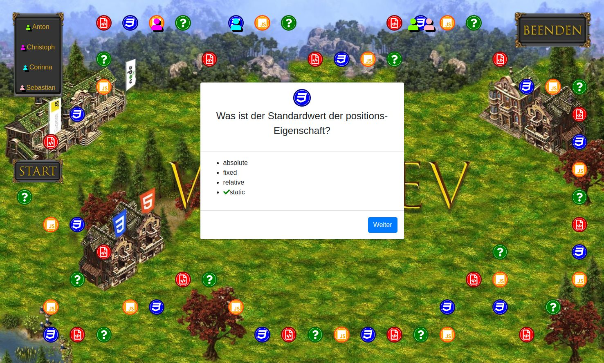

# WebDev - Das ~~Brett~~ Onlinespiel


Eine ausführliche Beschreibung des Projekts findest du in unserem [Frontend-Repository](https://github.com/fbw35-AbschlussprojektBrettspiel/fbw35-Abschlussprojekt_Frontend).

Wie weit reichen deine WebDev-Kenntnisse? Hier ist eine tolle Möglichkeit, es herauszufinden! Mit diesem Brettspiel kannst du alleine oder online mit anderen zusammen ganz einfach euer Wissen testen. Zusätzlich gibt es noch Witze und Anekdoten aus einem WebDev-Kurs.



[Beispiel-Deployment auf Heroku](https://webdev-brettspiel-frontend.herokuapp.com/)

## Installation

Um das Spiel zu clonen und zu starten, müssen [Git](https://git-scm.com) und [Node.js](https://nodejs.org/en/download/) auf dem Rechner installiert sein. Außerdem muss entweder [MongoDB](https://www.mongodb.com/) auf dem Rechner installiert sein, oder du benötigst einen Link zu einer MongoDB-Datenbank (wie z.B. [MongoDB Atlas](https://www.mongodb.com/cloud/atlas2)).

### Backend

Aus der Kommandozeile:

```bash
# Clone das Backend-Repository
$ git clone https://github.com/fbw35-AbschlussprojektBrettspiel/fbw35-Abschlussprojekt_Backend.git

# Gehe in das Verzeichnis
cd fbw35-Abschlussprojekt_Backend/

# Installiere Dependencies
$ npm install
```

Du kannst eine `.env` Datei im Root-Verzeichnes anlegen. Darin können die Umgebungsvariablen `PORT` für den benutzten Port und `DB` für die MongoDB angegeben werden. Ohne sie werden die Standardwerte `3050` und `mongodb://localhost:27017/quizfragen` benutzt.

```bash
# Skripts starten, um Fragen und Aktionen aus den JSON-Dateien in public-Ordner in die Datenbank zu schreiben
# Du kannst auch eigene json-Dateien benutzen
$ npm run pushFragen fragendatei.json
$ npm run pushAktionen aktiondatei.json

# Starte den Server
$ npm start

# Oder starte den Server mit nodemon
$ npm run watch
```